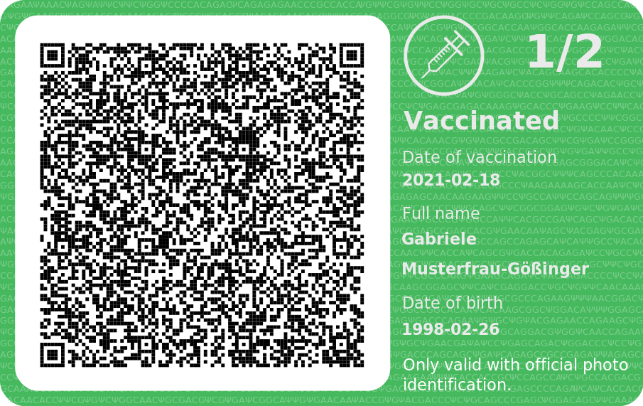

Green Pass Generator
====================

Generates a beautiful credit card sized PDF file which contains your green pass, to prove your
Covid-19 immune status.

Usage
-----

Then run the script, passing a picture which contains the QR code of your vaccination certificate:

    ./green-pass-generator -O output -i input/gabriele-musterfraugoessinger.png

Other command line parameters allow to set the output file name and to choose the SVG convert, see
output of `./green-pass-generator --help`.

If you want to generate multiple green pass cards, put all input files in the folder `input` and
run:

    for fname in $(cd input; ls);
        do ./green-pass-generator -O output -i input/$fname;
    done

**Disclaimer:** No guarantee given that the specification is completely fulfilled. It might work or
it might not work. Do run only with trusted input QR codes, there are no security checks. At the
moment there is no proper handling of test or recovery certificates.

Installation
------------

For MacOS and Linux you need to [install libzbar0](https://pypi.org/project/pyzbar/#installation),
e.g. by running:

    sudo apt install libzbar0

Then clone the Git repository and install all Python dependencies:

    git clone https://github.com/lumbric/green-pass-generator
    pip install -r requirements.txt

If you want to keep your OS clean, you can install the dependencies in a
[virtual environment](https://docs.python.org/3/tutorial/venv.html#creating-virtual-environments).

If you want to use [Inkscape](https://inkscape.org/) as SVG converter, use your OS' package manager
to install it or download it directly from their web page.

Is this legal?
--------------

Probably yes, but I am not sure what counts as proof of a valid certificate. In
Germany there is a [company selling such cards](https://immunkarte.de/) and
[several](https://praxistipps.chip.de/digitaler-impfpass-ohne-handy-nutzen-impfnachweis-ohne-smartphone_135563)
[newspaper](https://www.stuttgarter-nachrichten.de/inhalt.digitaler-impfpass-ohne-smartphone-mhsd.21f955ae-b81d-4410-a7aa-0a035a7feec7.html)
[articles](https://www.stuttgarter-nachrichten.de/inhalt.digitaler-impfpass-scheckkarte-mhsd.19d21b0c-1cbb-4345-8589-be23ec84fc01.html)
suggest that it should be fine. The [Austrian](https://www.ris.bka.gv.at/eli/bgbl/1950/186/P4b/NOR40238371?ResultFunctionToken=84eafd3c-8dcb-4e99-9191-5fadac1d04a1&Position=1&Sort=1%7cDesc&Abfrage=Bundesnormen&Kundmachungsorgan=&Index=&Titel=EpiG&Gesetzesnummer=&VonArtikel=&BisArtikel=&VonParagraf=&BisParagraf=&VonAnlage=&BisAnlage=&Typ=&Kundmachungsnummer=&Unterzeichnungsdatum=&FassungVom=27.01.2022&VonInkrafttretedatum=&BisInkrafttretedatum=&VonAusserkrafttretedatum=&BisAusserkrafttretedatum=&NormabschnittnummerKombination=Und&ImRisSeitVonDatum=&ImRisSeitBisDatum=&ImRisSeit=Undefined&ResultPageSize=100&Suchworte=)
[law](https://www.ris.bka.gv.at/GeltendeFassung.wxe?Abfrage=Bundesnormen&Gesetzesnummer=20011743)
does not seem to be very specific, whether you are allowed to produce your own proof containing a
valid QR code. Of course, this script can only re-generate a valid QR code. To generate a new
green pass certificate, you would need to have access to a valid
[private key](https://github.com/ehn-dcc-development/hcert-spec/blob/main/hcert_spec.md#62-key-management).

Links
-----

Certificate specification:
 - [Electronic Health Certificate Specification](https://github.com/ehn-dcc-development/hcert-spec/blob/main/hcert_spec.md)
 - [Invalid sample QR code](https://dgc.a-sit.at/ehn/)
 - [Script to generate an (invalid) QR code with arbitrary payload](https://github.com/ps1dr3x/greenpass-generator/)
 - [Instruction on hackernoon.com how to decode the Green Pass](https://hackernoon.com/how-to-decode-your-own-eu-vaccination-green-pass-with-a-few-lines-of-python-9v2c37s1)
 - [More instructions regarding the specification](https://www.gabriel.urdhr.fr/2021/09/22/whats-in-my-covid-cert/))

Similar projects:
 - [Immunkarte](https://immunkarte.de/])
 - [Green pass Card](https://factoryprint.it/tag-prodotto/green-pass/)
 - [Stampa green pass su card in PVC](https://www.seceservizi.com/prodotto/stampa-green-pass/)
 - [Green Pass Card Covid 19](https://www.personal-tech.it/it/id-card/9486-id-card-personalizzate.html)
 - [Green Pass - Card Personalizzata](https://www.fadoadv.it/negozio/Green-Pass-Card-Personalizzata-p394810909)
 - [Green Pass Personalizzato](https://www.point20.it/negozio/green-pass-personalizzato-su-card-in-pvc-con-qr-code-dimensione-biglietto-da-visita/)
